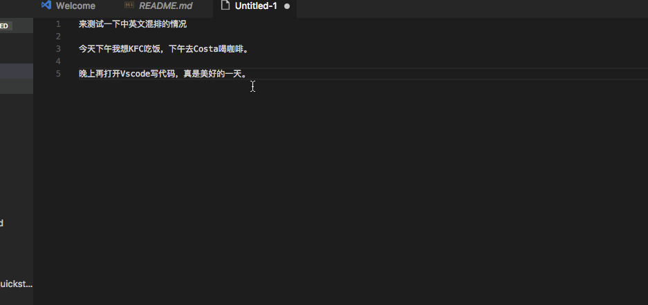

# Pangu

Pangu is a vscode plugin to add whitespace for chinese user.

# Install

Open up VS Code and hit `F1` and type `ext` select Install Extension and type `pangu` hit enter and reload window to enable.



## Features

* Add whitespace for your selection
* Add whitespace for whole active document

## Commands

- Pangu: Add whitespace for selection
- Pangu: Add whitespace for all

## Settings and defaults
``` JS
{
    /* Auto add whitespace on save, default false */
    "pangu.auto_space_on_save": false
}
```

## Known Issues

## Thanks
Thanks [vinta](https://github.com/vinta) for his great job [pangu.js](https://github.com/vinta/pangu.js)

**Enjoy!**
